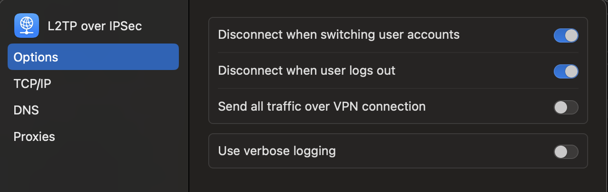

<p align="center">

<h3 align="center">MacOS application for advanced L2TP VPN split tunneling</h3>
</p>

## Features

- Automatically detects available L2TP VPN connections on your Mac
- Network and host management
- Sync routing configuration with active VPN connections
- Reset routing rules when needed
- Export/Import network host configurations as JSON for easy backup and sharing
- Built-in update checker with GitHub integration
- Clean UI with responsive design

## Quickstart

<p align="center">

</p>

1. **Configure your VPN and disable "Send all traffic over VPN"**

3. **Install Splitr** using one of the methods from the [Installation](#installation) section

4. **Launch Splitr** from Applications and add your network hosts or IP ranges

5. **Connect your VPN** and Splitr will automatically manage the routing rules

6. **Use the Sync button**: If routing is not applied correctly, click the "Sync" button in Splitr to refresh the routing configuration

7. **Reconnect VPN if needed**: If routing issues persist, disconnect and reconnect your VPN connection to ensure proper route establishment

That's it! Your specified hosts will now route through the VPN while other traffic uses your regular connection.

## Installation

### Homebrew (Recommended)

The easiest way to install Splitr is using Homebrew:

**Currently (using custom tap):**
```bash
# One-liner installation  
brew install --cask dmitrorlov/splitr/splitr

# Or step by step
brew tap dmitrorlov/splitr
brew install --cask splitr
```

**Benefits of Homebrew installation:**
- ✅ Automatic quarantine attribute removal (no manual `xattr` commands needed)
- ✅ Easy updates with `brew upgrade splitr`
- ✅ Proper installation to `/Applications`
- ✅ Clean uninstallation with `brew uninstall --cask splitr`

### Manual Installation

If you prefer not to use Homebrew:

1. Download the latest release from [GitHub Releases](https://github.com/dmitrorlov/splitr/releases)
2. Extract the ZIP file
3. Move `Splitr.app` to your `/Applications` folder
4. Remove quarantine attributes:
   ```bash
   xattr -cr /Applications/Splitr.app
   ```

## Updating

### Homebrew Users
```bash
brew upgrade splitr
```

If you got warning that latest version is already installed, run this before:

```bash
brew update
```

### Manual Installation Users
1. Download the new version
2. Replace the old app in `/Applications`
3. Run the `xattr` command again

The app also includes a built-in update checker accessible from the menu: **Splitr → Check for Updates...**

## Development

This project is built with:
- [Wails v2](https://wails.io/) - Go + Web frontend framework
- Go 1.24+ backend
- TypeScript frontend
- SQLite database

### Building from Source

1. Install [Task](https://taskfile.dev/) if you don't have it. Check [Task's installation instructions](https://taskfile.dev/installation/).

2. Install dependencies:
   ```bash
   task setup
   ```

3. Run in development mode:
   ```bash
   task dev
   ```

4. Build for production:
   ```bash
   task build
   ```

## Support

- 🐛 **Bug Reports**: [GitHub Issues](https://github.com/dmitrorlov/splitr/issues)
- 💡 **Feature Requests**: [GitHub Issues](https://github.com/dmitrorlov/splitr/issues)

## License

This project is licensed under the MIT License - see the [LICENSE](LICENSE) file for details.

## Contributing

Contributions are welcome! Please feel free to submit a Pull Request.

---

Made with ❤️ using [Wails](https://wails.io/)
